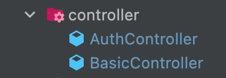
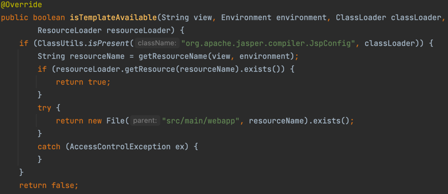

# 컨트롤러 클래스

## 애노테이션 기발 설계
MVC 패턴 중 핸들러 메소드를 포함하는 컨트롤러 빈을 만드는 과정

- @Controller
- @RestController = @ResponseBody + @Controller

### 핸들러 메소드 (Handler Method)
스프링 웹서비스가 받는 URI 요청을 컨트롤러 클래스의 특정 메소드에 매핑하는 과정

- @RequestMapping
- @GetMapping
- @PostMapping
- @PutMapping
- @DeleteMapping
- @PathMapping

처음 해야 할건 view와 컨트롤러를 만드는 것이다.

처음 컨트롤러

이 두개의 컨트롤러를 만들었다

처음 view 파일을 만들려고 할 때 스프링은 가장 기본적인
JSP 파일을 먼저 읽는다고 한다.

하지만 어디에 파일을 두더라도 파일을 읽지 못한다.

왜 그런가 확인해 봤더니 스프일은 src/main/webapp/* 안에있는 파일을 읽는 다는 것을 발견했다.

확인이 필요하면 검색창에 
JspTemplateAvailabilityProvider 를 쳐보면

경로를 확인 가능하다.

이런 상황을 바꾸는 방법은 thymeleaf 라는 템플릿 엔진을 사용한다.
