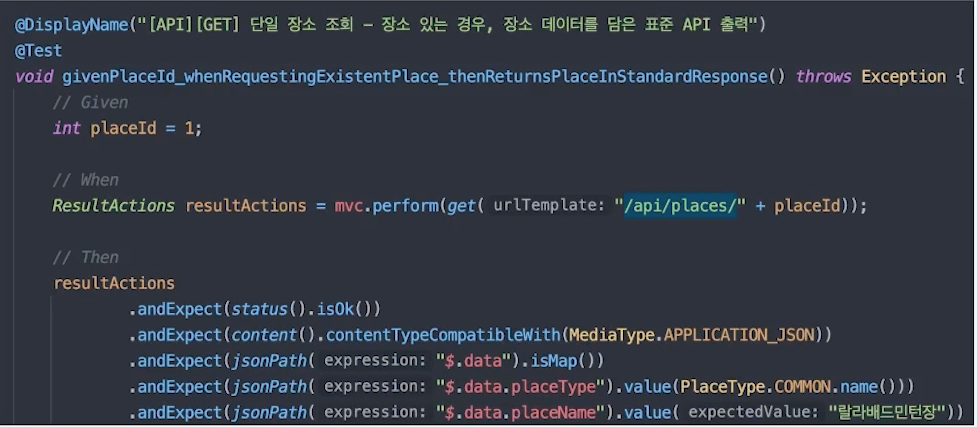
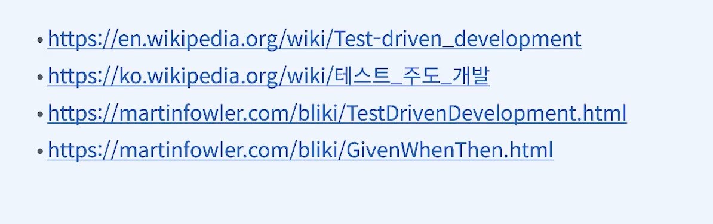

# TDD

> ## Test Driven Development(TDD)
> 테스트 주도 개발 기법
> - 프로그램의 설계와 구현, 사고의 흐름을 테스트 중심으로 생각하는 개발 방법
> - 개발 순서의 변화
>   - as-is: 구현한다 -> 테스트 한다
>   - to-be: 테스트를 만든다 -> 구현한다.
> - 주요 키워드: 익스트림 프로그래밍(XP), 애자일 , 폭포수 모델, Test-First-Programming

## RED-GREEN-REFACTOR
> ### TDD 개발 사이클
> 1. RED: (실패하는) 테스트를 짠다.(요구사항의 명세)
> 2. GREEN:테스트를 성공시킨다.(구현)
> 3. REFACTOR:구현 코드를 고도화(리팩토링)한다.

## Given - When - Then
> 테스트의 구조를 표현하는 방법 (a.k.a 3A, Arrange -Act - Assert)
> - Given(Arrange):상태(state)의 정의 - 테스트를 수행할 때 전제 조건
> - When(Act):동작 - 테스트 실행
> - Then(Assert):검증 - 동작의 결과(actual) vs. 예상값(expected)
> - 

## 김은호가 생각하는 TDD와 테스트

> ### Why TDD? WHT 테스트?
> ("협업(기업)코딩"환경에서 )왜 이걸 해야 할까?
> - 내가 지금 뭘 하려는지 명확히 안다는 사실을, 스스로 지속적으로 확인한다.
>   - 개발이 지연되는 이유 중 하나는, 막막해서 멍떄리기 때문
> - 내가 지금 뭘 하려는지 명확히 안다는 사실을, 동료와 소스 코드로 공유하고 소통(코드 리뷰) 한다.
>   - as-is1: 개발 계획을 별도의 문서로 공유한
>   - as-is2:개발 계획을 구현 코드로 공유한
>   - to-be:개발 계획을 테스트 코드로 공유함

> ### 테스트 내용의 발전 과정 (막연한 사람을 위한 가이드)
> 1. 메인 요구사항의 기본 목표 위주로만 우선 테스트를 작성
>   - 날짜를 yyyymmdd 포멧으로 입력하면, 정산일(D+3)을 계산한다.
> 2. 메인 요구사항 기본 + 세부 목표를 테스트로 작성
>   - 날짜를 yyyymmdd 포멧으로 입력하면, 정산일(D+3)을 계산해준다.
>   - 입력값이 없으면, 사용자에게 적절한 경고를 표시해준다.
>   - 2000.01.01 이전 날짜 입력은, 최초 정산일(2000.01.01)을 출력해준다.
>   - 매원 말일은, 빠른 정산일(D+2)을 계산해준다.
> 3. 메안 요구사항 기본 + 세부 + 더욱 구체적인 기능적 고려 요소
>   - 날짜를 yyyymmdd 포맷으로 입력하면, 정산일(D+3)을 계산한다.
>   - yyyy-mm-dd는? yyyymmdd는? 20210000은?20210231은?
>   - 입력값이 없으면, 에러로 응답한다.(표현 방법은 위임)
>   - null은? ""는? " "는? "   "는?
>   - 